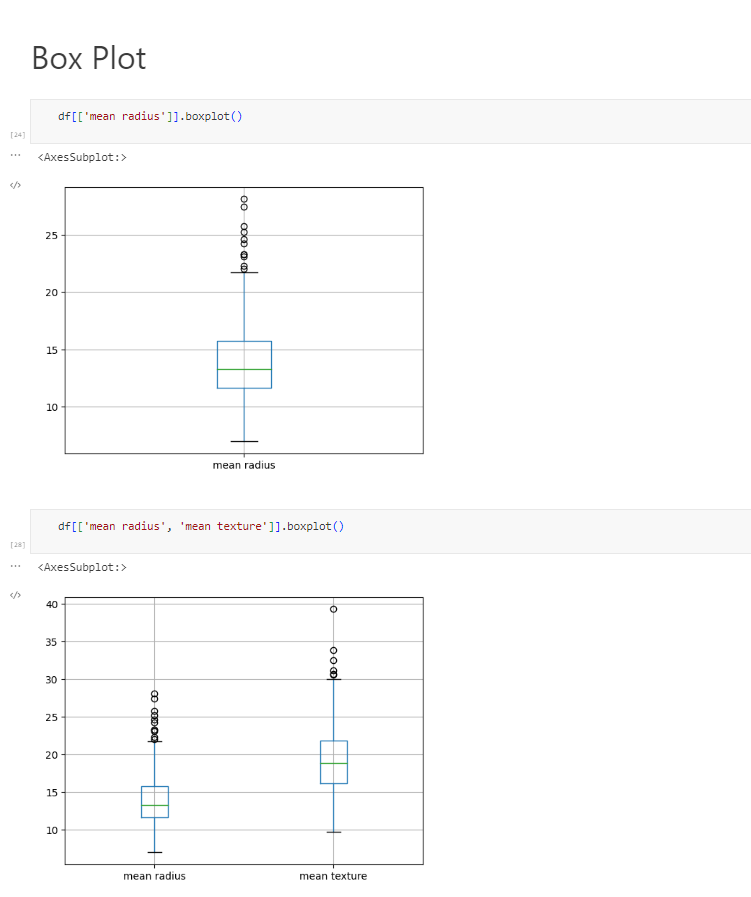

# Exploratory-Data-Analysis
Exploratory Data Analysis (EDA) is a crucial step in any machine learning project. It involves exploring the data, understanding its distribution, and identifying patterns and relationships between variables. This helps in gaining insights into the data, making informed decisions about feature engineering and model selection, and identifying potential outliers or anomalies.

This repository contains two Python scripts that perform EDA on a sample dataset named "sample_dataset.csv". The first script, "Exploratory data analysis Multi Variate.py", focuses on multivariate analysis, while the second script, "Exploratory data analysis Single Variate.py", focuses on univariate analysis.

### Exploratory Data Analysis Multi Variate.py

This script starts by importing the necessary libraries, including pandas and seaborn. The pandas library is used for data manipulation and analysis, while seaborn is used for data visualization.

The data is then read from the "sample_dataset.csv" file using the pandas read_csv() function.

The script then creates pair plots using the seaborn pairplot() function. Pair plots are useful for visualizing the relationships between pairs of variables. The script creates three different pair plots:

A scatter plot matrix of the first five variables in the dataset.
A histogram matrix of the first five variables in the dataset.
A kernel density estimation (KDE) plot matrix of the first five variables in the dataset.
The script then creates a correlation matrix using the pandas corr() function. A correlation matrix shows the correlation coefficients between each pair of variables in the dataset. The script also creates a heatmap of the correlation matrix using the seaborn heatmap() function.

Finally, the script creates stacked histograms of the "mean radius", "worst concavity", and "worst perimeter" variables, colored by the "target" variable. Stacked histograms are useful for visualizing the distribution of a variable across different categories.

### Exploratory Data Analysis Single Variate.py

This script starts by importing the necessary libraries, including pandas and matplotlib. The pandas library is used for data manipulation and analysis, while matplotlib is used for data visualization.

The data is then read from the "sample_dataset.csv" file using the pandas read_csv() function.

The script then prints the first few rows of the data using the pandas head() function. It also prints the column names, shape, data types, and information about the data using the pandas columns, shape, dtypes, info(), and isna().sum() functions.

The script then calculates the percentage of missing values and other features for analysis are taken in consideration.

          
